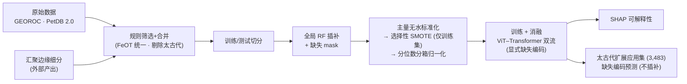

# 玄武岩构造环境判别：ViT–Transformer 双流深度学习模型
# Basalt Tectonic Discrimination via a Dual-Stream ViT–Transformer

> 基于 36 个主量 / 微量地球化学元素，对玄武岩样品进行 **9 类构造环境**判别的深度学习
> 流程，并将训练好的模型外推应用于**太古代**玄武岩，探讨早期地球构造体制。
>
> 本仓库随论文公开，提供从原始数据到模型训练、可解释性分析（SHAP）与太古代应用的
> **端到端、可复现**代码。


<!-- 论文发表后补充 DOI / Zenodo badge -->

---

## 1. 方法概述

主模型 **Full Model = ViT + Sequence Transformer 双流（GeoDAN，显式缺失编码）**：

- **矩阵分支（ViT）**：36 元素排成 **6×6 矩阵**，输入两个通道
  （分位数数值 + 原始缺失 mask）→ Patch Embedding → ViT Encoder；
- **序列分支（Transformer）**：36 元素按固定地球化学顺序成序列，每个元素携带
  两个特征（数值 + 缺失 mask）→ Linear Embedding → Transformer Encoder；
- **融合**：两分支均值池化 → 拼接 → MLP 分类头 → 9 类构造环境；
- **损失**：普通交叉熵（不加类别权重），类别不平衡由训练集选择性 SMOTE 处理。

`04_model/ablation_v4_vit_transformer.py` 一次性输出主模型与全部消融 / 对比 / 机器学习基线
（ViT-only、Transformer-only、无位置编码、CNN-BiLSTM、CNN-ViT-Transformer、CNN-only、
RF / SVM / XGBoost / MLP），多随机种子统计 mean ± std。

**9 类构造环境**：`SPREADING_CENTER`、`OCEAN_ISLAND`、`CONTINENTAL_RIFT`、
`OCEANIC_PLATEAU`、`CONTINENTAL_FLOOD_BASALT`、`BACK-ARC_BASIN`、`Island_arc`、
`Continental_arc`、`Intra-oceanic_arc`。

---

## 2. 流程总览



> 完整步骤、每步输入/输出与脚本对照见 **[docs/workflow.md](docs/workflow.md)**。

---

## 3. 目录结构

```
basalt_tectonic_discrimination/
├── config/paths.py            # ★ 集中路径配置（所有脚本由此获取数据/模型路径）
├── data/                      # 数据（大文件经 Zenodo 提供，见 data/README.md）
├── 01_preprocessing/          # 筛选 / 合并 / 切分
│   ├── filter/                #   extract_georoc.py · extract_petdb.py（正式规则筛选）
│   │                          #   + iron_normalization.py（FeOT 统一）
│   │                          #   + 交互式筛选 GUI / 分析器（可选调参工具）
│   ├── combine_list.py · split_train_test.py
├── 02_imputation/             # 全局随机森林插补（train fit / test transform）+ 缺失 mask
├── 03_normalization/          # 主量无水标准化 + 选择性 SMOTE（仅训练集）+ 分位数分箱归一化
├── 04_model/                  # ViT–Transformer 双流训练（显式缺失编码）+ 消融/对比/基线 + 5 折 CV
├── 05_interpretation/         # SHAP 可解释性（Figure 7）
├── 06_archean_application/    # 太古代扩展应用集构建 + 缺失编码预测 + 适用域/一致性分析
├── 07_figures/                # 论文图件（现代玄武岩数据分布箱线图）
├── tools/geochem_workflow_designer/  # 可视化工作流编排器（Python + Vue）
├── docs/workflow.md           # 端到端流程文档
├── requirements.txt · LICENSE · .gitignore
```

---

## 4. 环境与安装

建议 **Python ≥ 3.10**。

```bash
git clone <仓库地址>
cd basalt_tectonic_discrimination

# 创建虚拟环境（任选 conda / venv）
conda create -n basalt python=3.10 -y
conda activate basalt

# 安装依赖
pip install -r requirements.txt
```

> **PyTorch**：`requirements.txt` 中的 `torch` 为占位；请按 [pytorch.org](https://pytorch.org)
> 选择匹配本机 CUDA 版本的安装命令以启用 GPU 训练。训练（步骤 9）建议使用 GPU。

随后下载数据集（见 **[data/README.md](data/README.md)**）并放入 `data/` 对应子目录即可。

---

## 5. 快速复现

各阶段脚本均**无命令行参数**，配置集中在脚本顶部与 `config/paths.py`，直接运行即可：

```bash
# ① 预处理（正式筛选为非交互规则脚本；filter/ 下的 GUI 为可选调参工具）
python 01_preprocessing/filter/extract_georoc.py
python 01_preprocessing/filter/extract_petdb.py
python 01_preprocessing/combine_list.py
python 01_preprocessing/split_train_test.py

# ② 全局插补 + 缺失 mask（训练集 fit / 测试集 transform；太古代只产 mask 不插补）
python 02_imputation/imputation_train_predict.py

# ③ 标准化 / SMOTE / 归一化（分位数边界从 SMOTE 前训练集拟合）
python 03_normalization/normalize_major_elements.py
python 03_normalization/selective_smote.py
python 03_normalization/normalize.py

# ④ 训练（需 GPU；显式缺失编码：数值 + 缺失 mask 双通道）
python 04_model/ablation_v4_vit_transformer.py

# ④-1 可选：在现有 80% 训练集内部执行 5 折交叉验证（需 GPU）
python 04_model/kfold_vit_transformer.py

# ⑤ SHAP 可解释性
python 05_interpretation/plot_shap_figure7_summary.py

# ⑥ 太古代应用（缺失编码，不插补）
python 06_archean_application/extended_archean_pool_analysis.py            # 构建扩展应用集
python 06_archean_application/standardize_craton_with_ai.py                # 克拉通名称规范（需 LLM API）
python 06_archean_application/archean_vit_transformer_dualstream_predict_analysis.py  # 正式预测

# ⑦ 论文数据分布图
python 07_figures/selected_element_boxplots.py
```

### 5 折交叉验证

`04_model/kfold_vit_transformer.py` 不会读取固定保留的 20% 测试集。它只读取
`data/04_split/01_basalt_number_year_train.csv`，在这部分数据内部生成 5 个训练折和验证折。

每一折都与主流程方法学一致地重新执行：全局随机森林插补（折内训练 fit / 验证 transform）
并记录原始缺失 mask、主量无水归一化、仅折内训练数据的选择性 SMOTE（目标数量按折比例缩放）、
SMOTE 前训练折分位数拟合、验证折转换和带缺失编码的模型训练。每折使用随机种子
`42`、`123`。

逐次结果和汇总结果分别输出到：

- `data/models/kfold/kfold_per_run_results.csv`
- `data/models/kfold/kfold_summary.csv`

**防数据泄露**：训练/测试集在步骤 ①（`split_train_test.py`）即切分；此后全局插补器、
SMOTE、分位数边界等 **fit 仅用训练集**（分位数从 SMOTE 前训练集拟合），
测试集与太古代集只 transform；太古代集不插补，缺失值以"数值 0 + mask 1"显式编码。

---

## 6. 数据可用性

- 完整数据集（约 400 MB）将通过 **Zenodo / figshare** 存档（DOI 占位，见 [data/README.md](data/README.md)）。
- 原始数据来自 **GEOROC** 与 **PetDB**；汇聚边缘构造环境的再分类由独立项目
  `convergent_margin_reclass`（含 LLM 辅助复核）产出，本仓库仅以其结果作为输入起点。
- 大数据与模型权重默认经 `.gitignore` 排除，不进入版本库。

---

## 7. 可视化工作流编排器（tools/geochem_workflow_designer）

一个可拖拽编排上述数据处理 / 训练流程并可视化的工具（Python 后端 + Vue 前端）：

```bash
cd tools/geochem_workflow_designer
pip install -r requirements.txt
npm install            # 安装前端依赖（node_modules 未纳入版本库）
python app.py          # 启动后端 API + Vue 前端
# 仅后端： python app.py --backend-only
```

`workflows/` 下提供若干示例工作流定义（`.json`）。
> 注意：示例工作流中的文件路径为作者本地环境路径，复用时请在界面中按本地实际路径调整。

---

## 8. 结果与图件对照

| 图件 | 脚本 |
|---|---|
| 现代玄武岩各元素数据分布箱线图 | `07_figures/selected_element_boxplots.py` |
| SHAP 全局/分类重要性与方向（Figure 7） | `05_interpretation/plot_shap_figure7_summary.py` |
| 太古代构造亲和性随年龄/克拉通演化、与传统判别指标对比 | `06_archean_application/archean_vit_transformer_dualstream_predict_analysis.py` |
| 现代训练集 vs 太古代应用集分布一致性（PCA / 主量 / 判别比值） | `06_archean_application/pca_distribution_consistency.py`、`training_application_distribution_consistency.py` |
| 混淆矩阵、训练曲线、消融对比柱状图 | `04_model/ablation_v4_vit_transformer.py` |

---

## 9. 引用 / Citation

```bibtex
@article{<占位_citekey>,
  title   = {<论文标题占位>},
  author  = {<作者列表占位>},
  journal = {<期刊占位>},
  year    = {2026},
  doi     = {<占位>}
}
```

## 10. 许可 / 致谢 / 联系

- **许可**：本项目以 [MIT License](LICENSE) 开源（请在 `LICENSE` 中补全作者信息）。
- **致谢**：GEOROC、PetDB 数据库及相关数据贡献者；Liu et al. (2024) 太古代数据集。
- **联系**：`<作者邮箱 / 通讯方式占位>`
