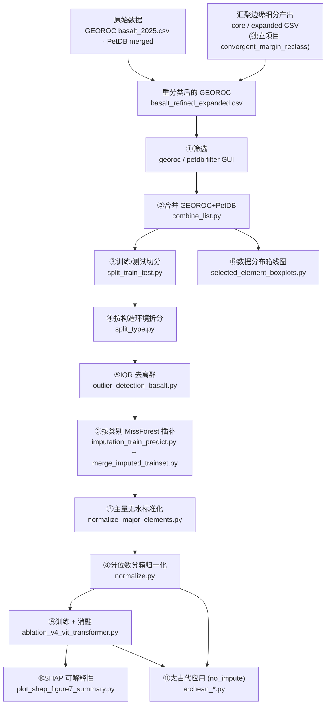

# 端到端流程详解（Workflow）

本文件给出从原始数据到模型训练、可解释性分析与太古代应用的完整步骤，
以及每一步的**脚本 / 输入 / 输出**对照。所有路径常量集中定义在
[`config/paths.py`](../config/paths.py)，脚本不含硬编码绝对路径。

> 关于数据泄露：训练/测试集在流程**最开始**（步骤 5）即按分层抽样切分，
> 之后所有 fit 类操作（MissForest 插补、分位数边界）**仅在训练集上拟合**，
> 测试集与太古代应用集只做 transform。目前未做 KFold，也未做空间区域划分。

---

## 流程总览



---

## 分步对照表

| # | 阶段 | 脚本 | 输入 | 输出 |
|---|---|---|---|---|
| 0 | 汇聚边缘细分（外部） | *（不在本仓库）* `convergent_margin_reclass` | GEOROC 原始 | `01_cm_reclass_input/` 下 core / expanded / `basalt_refined_expanded.csv` |
| 1 | 筛选 | `01_preprocessing/filter/georoc_filter_tuner_gui.py`、`petdb_filter_tuner_gui.py` | `basalt_refined_expanded.csv` / PetDB 原始 | `02_filtered/basalt_refined_expanded_filtered.csv`、`petDB.csv` |
| 2 | 合并 | `01_preprocessing/combine_list.py` | 两个筛选结果 | `03_combined/01_basalt_number_year.csv` |
| 3 | 训练/测试切分 | `01_preprocessing/split_train_test.py` | 合并表 | `04_split/01_basalt_number_year_{train,test}.csv` |
| 4 | 按构造环境拆分 | `01_preprocessing/split_type.py` | 训练集 | `04_split/preprocess/split/<构造环境>.csv` |
| 5 | IQR 去离群 | `01_preprocessing/outlier_detection_basalt.py` | 各构造环境训练子集 | `04_split/preprocess/clean/<构造环境>_clean.csv` |
| 6a | 按类别 MissForest 插补 | `02_imputation/imputation_train_predict.py` | clean 训练子集 + 测试集 | `05_imputed/MissForest/*_clean_imputed.csv`、`02_basalt_test_imputed.csv` |
| 6b | 合并训练插补结果 | `02_imputation/merge_imputed_trainset.py` | `MissForest/*_clean_imputed.csv` | `05_imputed/02_basalt_train_imputed.csv` |
| 7 | 主量无水标准化 | `03_normalization/normalize_major_elements.py` | `02_basalt_{train,test}_imputed.csv` | `06_normalized/03_basalt_{train,test}_major_normalize.csv` |
| 8 | 分位数分箱归一化 | `03_normalization/normalize.py` | `03_basalt_{train,test}_major_normalize.csv` | `06_normalized/05_normalize_basalt_{train,test}.csv` + `quantile_params.json` |
| 9 | 训练 + 消融 + 基线 | `04_model/ablation_v4_vit_transformer.py` | `05_normalize_basalt_{train,test}.csv` | `models/` 权重 `.pth`、消融结果 CSV、图件 |
| 10 | SHAP 可解释性 | `05_interpretation/plot_shap_figure7_summary.py`（依赖 `shap_vit_transformer_dualstream.py`） | 归一化训练/测试集 + 模型权重 | `models/shap_analysis/` 图件 |
| 11 | 太古代应用预处理 | `06_archean_application/archean_s3_preprocess.py`（`PREPROCESS_MODE="no_impute"`） | `archean/data/` + `quantile_params.json` | `archean/outputs/.../preprocess_no_impute/` |
| 11 | 太古代预测与分析 | `06_archean_application/archean_vit_transformer_dualstream_predict_analysis.py`（`PREDICT_PREPROCESS_VARIANT="no_impute"`） | 预处理输出 + 模型权重 | `archean/outputs/.../prediction_no_impute/` |
| 11 | 分布一致性 | `06_archean_application/pca_distribution_consistency.py`、`training_application_distribution_consistency.py` | 现代全集 + 太古代集 | 一致性图件 |
| 12 | 数据分布箱线图 | `07_figures/selected_element_boxplots.py` | `03_combined/01_basalt_number_year.csv` | `figures/selected_elements/` |

---

## 关键约定（统一基准）

- **最终归一化数据集**统一为 `06_normalized/05_normalize_basalt_{train,test}.csv`；
  训练、SHAP、太古代脚本均读取此基准（已消除历史遗留的 `dataset_split_correct` /
  `06_normalize_*` 命名分歧）。
- **模型权重**统一输出/读取 `models/Full_Model_(ViT+Transformer)_best_seed.pth`。
- **太古代不插补**：缺失值置 0，仅用训练集 `quantile_params.json` 做分位归一化，
  不依赖任何全局 MissForest 模型。

---

## 运行顺序（最小复现）

```bash
# 1–5 预处理
python 01_preprocessing/filter/georoc_filter_tuner_gui.py   # GUI，交互筛选
python 01_preprocessing/filter/petdb_filter_tuner_gui.py    # GUI，交互筛选
python 01_preprocessing/combine_list.py
python 01_preprocessing/split_train_test.py
python 01_preprocessing/split_type.py
python 01_preprocessing/outlier_detection_basalt.py
# 6 插补
python 02_imputation/imputation_train_predict.py
python 02_imputation/merge_imputed_trainset.py
# 7–8 标准化 / 归一化
python 03_normalization/normalize_major_elements.py
python 03_normalization/normalize.py
# 9 训练（需 GPU）
python 04_model/ablation_v4_vit_transformer.py
# 10 SHAP
python 05_interpretation/plot_shap_figure7_summary.py
# 11 太古代应用
python 06_archean_application/archean_s3_preprocess.py
python 06_archean_application/archean_vit_transformer_dualstream_predict_analysis.py
# 12 数据分布图
python 07_figures/selected_element_boxplots.py
```
