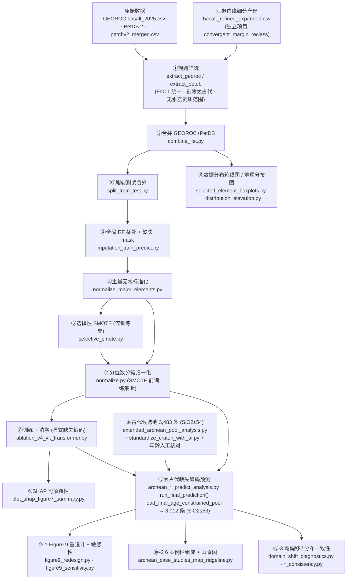

# 端到端流程详解（Workflow）

本文件给出从原始数据到模型训练、可解释性分析与太古代应用的完整步骤，
以及每一步的**脚本 / 输入 / 输出**对照。所有路径常量集中定义在
[`config/paths.py`](../config/paths.py)，脚本不含硬编码绝对路径。

> 关于数据泄露：训练/测试集在流程**最开始**（步骤 ③）即按分层抽样切分，
> 之后所有 fit 类操作（全局随机森林插补器、SMOTE、分位数边界）**仅在训练集上拟合**，
> 测试集与太古代应用集只做 transform；分位数边界必须从 **SMOTE 之前**的真实训练集拟合。

## 核心方法约定（GeoDAN 显式缺失编码）

- **插补**：现代数据由训练集拟合**一套全局** `StandardScaler` + 36 个
  `RandomForestRegressor`（每个元素用其余 35 个元素预测）补齐缺失；
  `TECTONIC SETTING` 不参与插补拟合。插补**之前**的原始缺失状态保存为
  二值 mask（1=原始缺失，0=原始实测），训练时作为模型第二通道输入。
- **太古代不插补**：缺失元素数值固定编码为 `0`，并由 36 维二值 mask
  显式告诉模型哪里缺失；绝不使用现代随机森林插补器。
- **类别不平衡**：仅训练集对五个少数类（Island arc / Intra-oceanic arc /
  BACK-ARC_BASIN / OCEANIC PLATEAU / CONTINENTAL_RIFT）用普通 SMOTE 补到
  3,000 条；损失为普通交叉熵，**不使用类别权重**。SMOTE 合成行的缺失
  mask 统一为 0。
- **双流输入**：ViT 分支把 36 元素组织成两张 `6×6` 图（数值 + 掩码），
  Transformer 分支让每个元素携带两个特征（数值 + 掩码）。

---

## 流程总览



---

## 分步对照表

| # | 阶段 | 脚本 | 输入 | 输出 |
|---|---|---|---|---|
| 0 | 汇聚边缘细分（外部） | *（不在本仓库）* `convergent_margin_reclass` | GEOROC 原始 | `01_cm_reclass_input/basalt_refined_expanded.csv` |
| 1a | GEOROC 规则筛选 | `01_preprocessing/filter/extract_georoc.py` | `basalt_refined_expanded.csv` + `00_raw/georoc/references_structured.csv` | `02_filtered/basalt_refined_expanded_filtered.csv` |
| 1b | PetDB 规则筛选 | `01_preprocessing/filter/extract_petdb.py` | `00_raw/petdb/petdbv2_merged.csv` | `02_filtered/petDB.csv` |
| 2 | 合并 | `01_preprocessing/combine_list.py` | 两个筛选结果 | `03_combined/01_basalt_number_year.csv` |
| 3 | 训练/测试切分（分层 0.2，seed=32） | `01_preprocessing/split_train_test.py` | 合并表 | `04_split/01_basalt_number_year_{train,test}.csv` |
| 4 | 全局 RF 插补 + 缺失 mask | `02_imputation/imputation_train_predict.py` | 训练集（fit）+ 测试集（transform） | `05_imputed/02_basalt_{train,test}_imputed.csv`、`05_imputed/03_{train,test}_missing_mask.csv` |
| 5 | 主量无水标准化（逐行，无拟合参数） | `03_normalization/normalize_major_elements.py` | `02_basalt_{train,test}_imputed.csv` | `06_normalized/04_basalt_{train,test}_major_normalize.csv` |
| 6 | 选择性 SMOTE（仅训练集，5 类补到 3000） | `03_normalization/selective_smote.py` | `04_basalt_train_major_normalize.csv` | `06_normalized/05_basalt_train_selected_smote.csv` |
| 7 | 分位数分箱归一化（SMOTE 前训练集 fit） | `03_normalization/normalize.py` | SMOTE 前/后训练集 + 测试集 | `06_normalized/06_normalize_basalt_train{,_no_smote}.csv`、`06_normalize_basalt_test.csv`、`quantile_params.json` |
| 8 | 训练 + 消融 + 基线（显式缺失编码） | `04_model/ablation_v4_vit_transformer.py` | `06_normalize_basalt_{train,test}.csv` + 两个 missing mask | `models/` 权重 `.pth`、消融结果 CSV、图件 |
| 9a | SHAP 可解释性 | `05_interpretation/plot_shap_figure7_summary.py`（依赖 `shap_vit_transformer_dualstream.py`） | 归一化训练/测试集 + missing mask + 模型权重 | `models/shap_analysis/figure7_panels_true_class_median/` 图件 |
| 9b | Figure 7 a/c 从缓存重绘 | `05_interpretation/plot_shap_figure7_ac_from_saved.py` | 9a 保存的 `shap_merged_n*.npy` / `explain_idx_n*.npy` | `Figure7a_heatmap.png`、`Figure7c_ranking.png`、`Figure7a_c_combined.png` |
| 10a | 太古代候选池构建 | `06_archean_application/extended_archean_pool_analysis.py` | Liu 数据 + GeoROC 原始候选表 + PetDB 2.0 | `extended_archean_pool/expanded_archean_raw.csv` 等（3,483 条，SiO2≤54） |
| 10b | 克拉通名称规范（LLM 辅助） | `06_archean_application/standardize_craton_with_ai.py` | 候选池预测表 | `extended_archean_pool/expanded_archean_basalt.csv`；经**年龄人工核对**并删除年龄为空记录后得到候选池 `expanded_archean_basalt_age_nonmissing.csv`（3,483 条） |
| 10c | 太古代缺失编码预测（正式入口） | `06_archean_application/archean_vit_transformer_dualstream_predict_analysis.py`（`run_final_prediction()`） | 3,483 候选池 → `load_final_age_constrained_pool` 筛 SiO2≤53 得 3,012 条 + `quantile_params.json` + 模型权重 | `archean_geodan_final/expanded_archean_{missing_mask,predictions}.csv`、主图 + 6 案例区预测 |
| 10d | Figure 9 重设计 + 分箱敏感性 | `06_archean_application/figure9_redesign.py`、`figure9_sensitivity.py` | `archean_geodan_final/expanded_archean_predictions.csv` | `archean_geodan_final/fig9_redesign_*.png`、`fig9_sensitivity.png` |
| 10e | 6 克拉通案例组成 + 山脊图 | `06_archean_application/archean_case_studies_map_ridgeline.py` | `archean_case_studies/predictions/*_predictions.csv` | `fig_case_studies_bars_ridgeline.png` 等 |
| 10f | 适用域 / 域偏移诊断 | `06_archean_application/domain_shift_diagnostics.py` | 现代训练集 + 太古代集 | `archean/outputs/distribution_consistency/domain_shift_*` |
| 10g | 分布一致性 | `06_archean_application/pca_distribution_consistency.py`、`training_application_distribution_consistency.py` | 现代全集 + 太古代集 | `distribution_consistency/` 一致性图件 |
| 11 | 数据分布箱线图 / 全球地理分布图 | `07_figures/selected_element_boxplots.py`、`distribution_elevation.py` | `03_combined/01_basalt_number_year.csv`（+ 自备世界底图） | `figures/selected_elements/`、`figures/distribution_basalt_map_esri.png` |

> 辅助工具：`01_preprocessing/filter/georoc_filter_tuner_gui.py` 与
> `petdb_filter_tuner_gui.py` 为**可选**交互式调参 GUI，用于探索筛选阈值；
> 正式流程以 `extract_georoc.py` / `extract_petdb.py` 的固化规则为准。

---

## 关键约定（统一基准）

- **最终归一化数据集**统一为 `06_normalized/06_normalize_basalt_{train,test}.csv`；
  训练、SHAP、太古代脚本均读取此基准。
- **缺失 mask** 统一为 `05_imputed/03_{train,test}_missing_mask.csv`，
  记录插补**之前**的原始缺失状态；模型训练与 SHAP 均将其作为第二通道。
- **模型权重**统一输出/读取 `models/Full_Model_(ViT+Transformer)_best_seed.pth`。
- **太古代缺失编码**：缺失值数值编码 `0` + mask 值 `1`，只用训练集
  `quantile_params.json` 做分位归一化，不依赖任何现代插补模型；
  正式预测结果以 `archean_geodan_final/expanded_archean_predictions.csv` 为准
  （含 `pred_class_name`、`pred_prob_max`、`confidence_tier`、九类 `prob_*`、
  `missing_feature_count_36` 及三类弧概率之和 `Arc_probability3`）。

---

## 运行顺序（最小复现）

```bash
# 1–3 预处理（GUI 为可选调参工具，不在正式链路内）
python 01_preprocessing/filter/extract_georoc.py
python 01_preprocessing/filter/extract_petdb.py
python 01_preprocessing/combine_list.py
python 01_preprocessing/split_train_test.py
# 4 全局插补 + 缺失 mask
python 02_imputation/imputation_train_predict.py
# 5–7 标准化 / SMOTE / 归一化
python 03_normalization/normalize_major_elements.py
python 03_normalization/selective_smote.py
python 03_normalization/normalize.py
# 8 训练（需 GPU）
python 04_model/ablation_v4_vit_transformer.py
# 9 SHAP（true_class_median 口径；ac_from_saved 可从缓存重绘）
python 05_interpretation/plot_shap_figure7_summary.py
python 05_interpretation/plot_shap_figure7_ac_from_saved.py
# 10 太古代应用（已有候选池/正式预测时可只跑需要的子步）
python 06_archean_application/extended_archean_pool_analysis.py
python 06_archean_application/standardize_craton_with_ai.py   # 需配置 LLM API
python 06_archean_application/archean_vit_transformer_dualstream_predict_analysis.py
python 06_archean_application/figure9_redesign.py             # Figure 9 重设计主图
python 06_archean_application/figure9_sensitivity.py          # Figure 9 分箱敏感性附图
python 06_archean_application/archean_case_studies_map_ridgeline.py  # 6 案例区组成 + 山脊图
# 11 数据分布图
python 07_figures/selected_element_boxplots.py
python 07_figures/distribution_elevation.py                  # 可选：需自备世界底图
```
